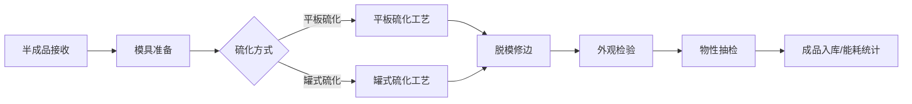

## 1. 产品概述
橡胶硫化车间制品硫化业务管理客户端软件，用于硫化车间全流程管理半成品、硫化和质检环节，提升生产效率与产品质量追溯能力。
- 面向车间管理人员、硫化操作工、质检员，覆盖从半成品接收到最终质检的完整业务流程
- 实现生产数据可视化、工艺参数监控、质量追溯和能耗统计分析

## 2. 核心功能

### 2.1 用户角色
| 角色 | 注册方式 | 核心权限 |
|------|----------|----------|
| 车间管理员 | 系统内置 | 全部模块操作、数据统计、参数配置 |
| 硫化操作工 | 系统内置 | 半成品接收、模具准备、平板/罐式硫化、脱模修边操作 |
| 质检员 | 系统内置 | 外观检验、物性抽检操作与记录 |

### 2.2 功能模块
1. **工作台首页**：数据概览、今日任务、在制状态、快速入口
2. **半成品接收**：胶料批次登记、入库记录、数量核对
3. **模具准备**：模具预热记录、模具状态管理、领用归还
4. **平板硫化**：硫化压力监控、温度曲线实时显示、工艺参数记录
5. **罐式硫化**：硫化罐蒸汽压监控、硫化时间控制、批次记录
6. **脱模修边**：产品脱模记录、毛边修整记录、合格率统计
7. **外观检验**：气泡缺胶检查、尺寸符合性检测、外观判定
8. **物性抽检**：硬度抽检、老化试验、物性指标统计
9. **能耗统计**：硫化能耗数据汇总、趋势分析、报表导出

### 2.3 页面详情
| 页面名称 | 模块名称 | 功能描述 |
|----------|----------|----------|
| 工作台首页 | 数据概览卡片 | 显示今日产量、合格率、能耗、在制批次等关键指标 |
| 工作台首页 | 在制状态看板 | 各工序在制产品数量与状态展示 |
| 工作台首页 | 快速入口 | 7个模块快捷操作按钮 |
| 半成品接收 | 胶料接收登记表单 | 录入胶料批次号、胶种、数量、接收人、生产日期 |
| 半成品接收 | 批次列表 | 显示历史接收记录，支持搜索筛选 |
| 模具准备 | 模具预热记录 | 录入模具编号、预热温度、预热时间、操作工 |
| 模具准备 | 模具状态管理 | 模具领用、归还、维修状态跟踪 |
| 平板硫化 | 工艺参数配置 | 设定硫化压力、温度、时间等参数 |
| 平板硫化 | 温度曲线图 | 实时温度曲线显示，历史曲线回放 |
| 平板硫化 | 压力监控面板 | 实时压力数值显示，超压告警 |
| 罐式硫化 | 蒸汽压监控 | 实时蒸汽压力显示与记录 |
| 罐式硫化 | 硫化计时 | 倒计时显示，硫化完成提醒 |
| 脱模修边 | 脱模记录 | 产品编号、脱模时间、操作工、合格品数量记录 |
| 脱模修边 | 毛边修整 | 修整数量、废品数量、修整人员记录 |
| 外观检验 | 气泡缺胶检查 | 缺陷类型、缺陷数量、位置记录 |
| 外观检验 | 尺寸符合性 | 关键尺寸测量值与公差对比判定 |
| 外观检验 | 外观判定 | 合格/不合格判定，不合格原因记录 |
| 物性抽检 | 硬度抽检 | 邵氏硬度测量值记录与合格判定 |
| 物性抽检 | 老化试验 | 试验条件、试验前后性能对比记录 |
| 能耗统计 | 能耗汇总 | 按日/周/月汇总水电气能耗数据 |
| 能耗统计 | 趋势分析图表 | 能耗趋势折线图、分类占比饼图 |
| 能耗统计 | 报表导出 | Excel格式报表导出功能 |

## 3. 核心流程
橡胶硫化车间生产流程：半成品胶料入库→模具准备预热→平板/罐式硫化→脱模修边→外观检验→物性抽检→成品入库，各环节数据实时记录并可追溯。

## 4. 用户界面设计

### 4.1 设计风格
- **主色调**：工业深蓝(#1e3a5f)，代表专业与工业属性
- **辅助色**：橙红(#e85d26)用于告警/高亮，翠绿(#2e8b57)用于合格/正常状态
- **中性色**：深灰(#2d3748)文字、浅灰(#f7fafc)背景、中灰(#cbd5e0)边框
- **按钮风格**：圆角4px，主按钮蓝底白字，次要按钮灰底黑字，悬停阴影效果
- **字体**：标题使用思源黑体Bold，正文使用思源黑体Regular，数据使用等宽字体
- **布局风格**：左侧导航栏+顶部标题栏+右侧内容区的经典工业软件布局
- **图标风格**：Lucide线性图标，工业感强，统一线宽

### 4.2 页面设计概览
| 页面名称 | 模块名称 | UI元素 |
|----------|----------|--------|
| 工作台首页 | 数据概览卡片 | 卡片式布局、渐变背景、数据动画、状态指示灯 |
| 工作台首页 | 在制状态看板 | 横向时间轴、状态色块、进度条 |
| 数据录入页面 | 表单区域 | 分组表单、下拉选择、日期时间选择器、数字输入框 |
| 数据列表页面 | 数据表格 | 斑马纹、固定表头、行内操作、分页、筛选条件 |
| 监控页面 | 实时图表 | 温度曲线图、压力仪表盘、告警弹窗、实时数据刷新 |
| 统计页面 | 分析图表 | 柱状图、折线图、饼图、多维度筛选 |

### 4.3 响应式设计
- 桌面端优先设计，最小支持宽度1280px
- 侧边栏可折叠，适配不同屏幕宽度
- 数据表格支持横向滚动
- 触控设备优化按钮尺寸，最小40x40px
