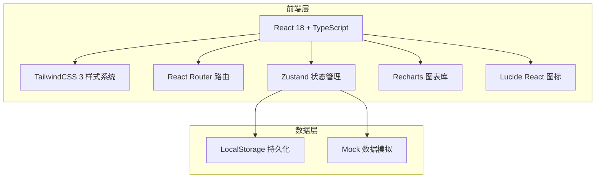
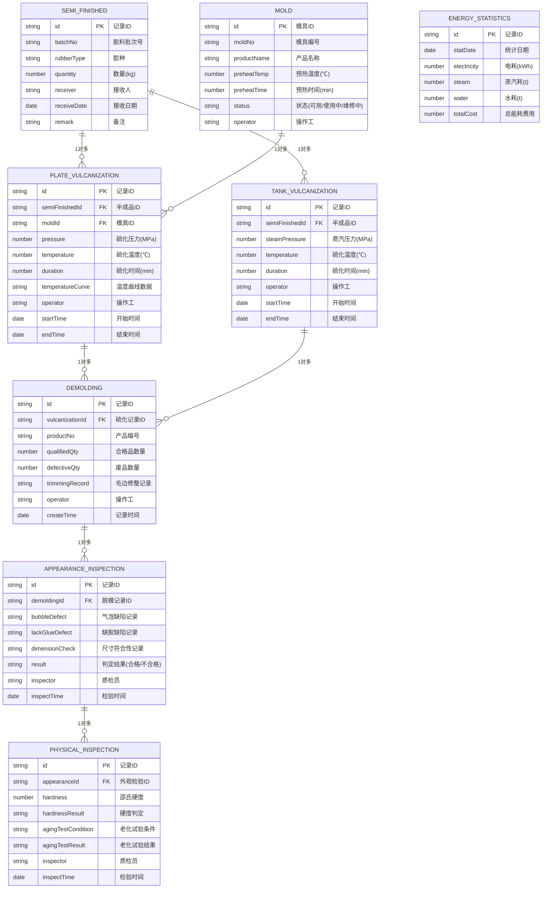

## 1. 架构设计



## 2. 技术描述
- 前端：React@18 + TypeScript + TailwindCSS@3 + Vite
- 初始化工具：vite-init react-ts 模板
- 后端：无（纯前端应用，使用 LocalStorage 持久化 + Mock 数据）
- 数据库：LocalStorage 浏览器本地存储
- 图表库：Recharts
- 图标库：Lucide React
- 状态管理：Zustand

## 3. 路由定义
| 路由 | 页面用途 |
|------|----------|
| /dashboard | 工作台首页 - 数据概览与快速入口 |
| /semi-finished | 半成品接收模块 |
| /mold-prep | 模具准备模块 |
| /plate-vulcanization | 平板硫化模块 |
| /tank-vulcanization | 罐式硫化模块 |
| /demolding | 脱模修边模块 |
| /appearance-inspection | 外观检验模块 |
| /physical-inspection | 物性抽检模块 |
| /energy-statistics | 能耗统计模块 |

## 4. 数据模型

### 4.1 数据模型定义



## 5. 项目目录结构

```
src/
├── components/          # 公共组件
│   ├── Layout/          # 布局组件
│   ├── Card/            # 统计卡片
│   ├── Table/           # 数据表格
│   ├── Form/            # 表单组件
│   └── Chart/           # 图表组件
├── pages/               # 页面组件
│   ├── Dashboard/       # 工作台首页
│   ├── SemiFinished/    # 半成品接收
│   ├── MoldPrep/        # 模具准备
│   ├── PlateVulcanization/  # 平板硫化
│   ├── TankVulcanization/   # 罐式硫化
│   ├── Demolding/       # 脱模修边
│   ├── AppearanceInspection/  # 外观检验
│   ├── PhysicalInspection/    # 物性抽检
│   └── EnergyStatistics/      # 能耗统计
├── store/               # Zustand 状态管理
├── types/               # TypeScript 类型定义
├── utils/               # 工具函数
├── data/                # Mock 数据
├── App.tsx              # 应用入口
└── main.tsx             # 渲染入口
```
